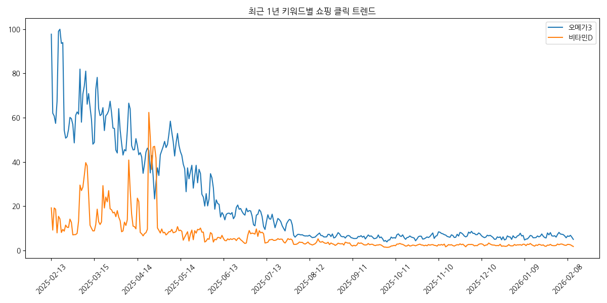
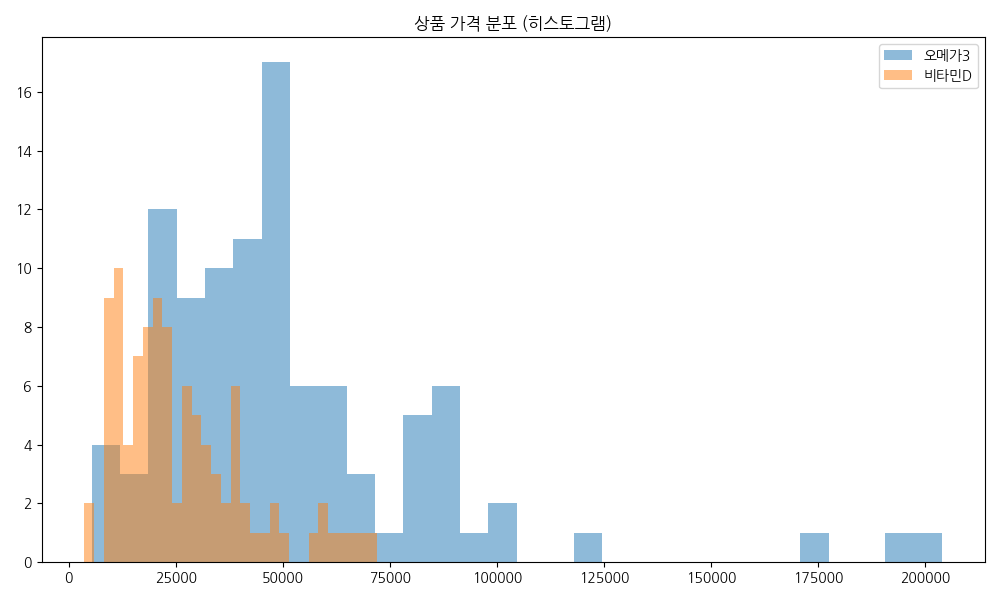
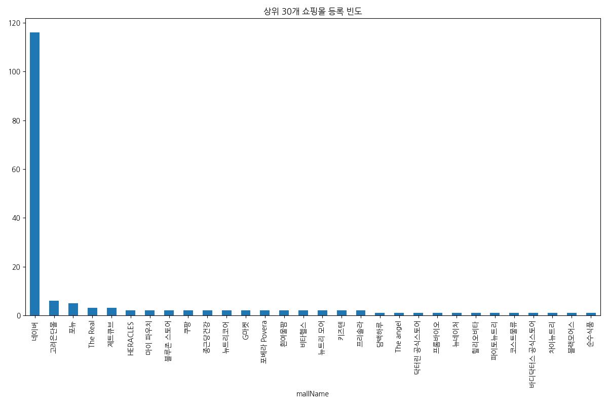
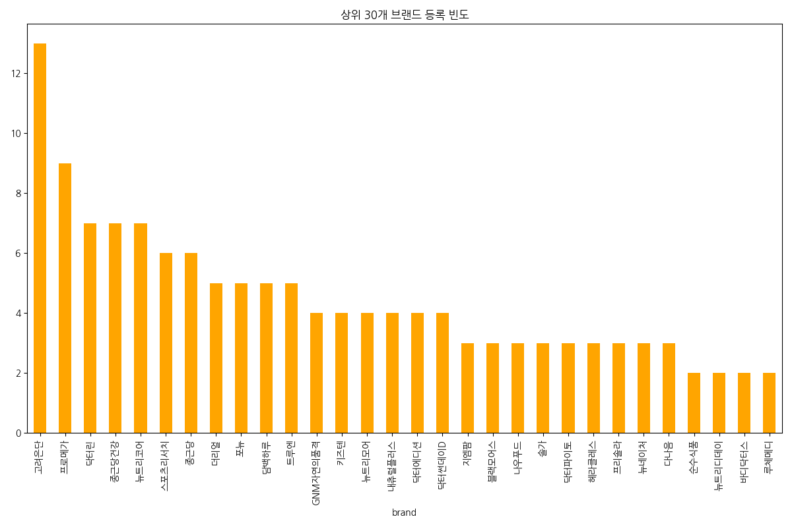
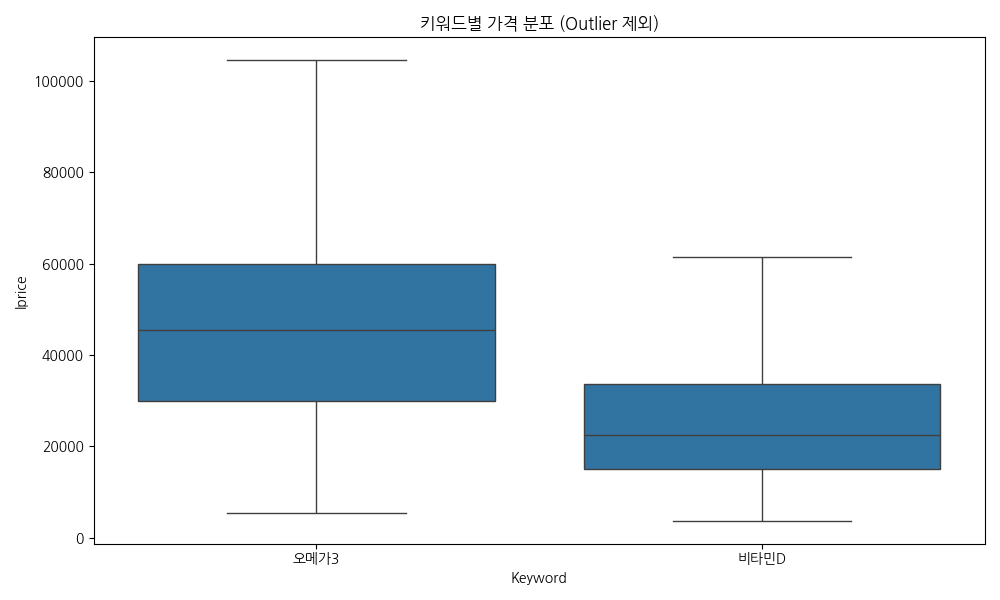
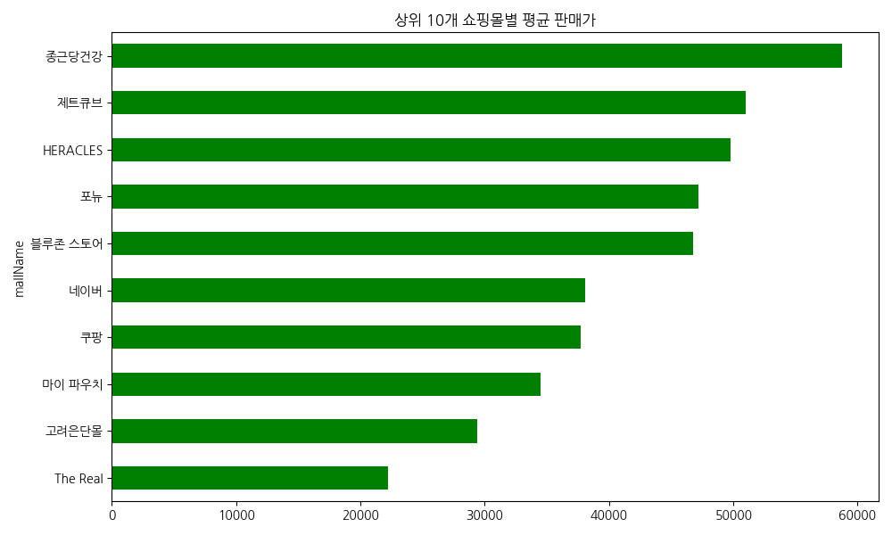
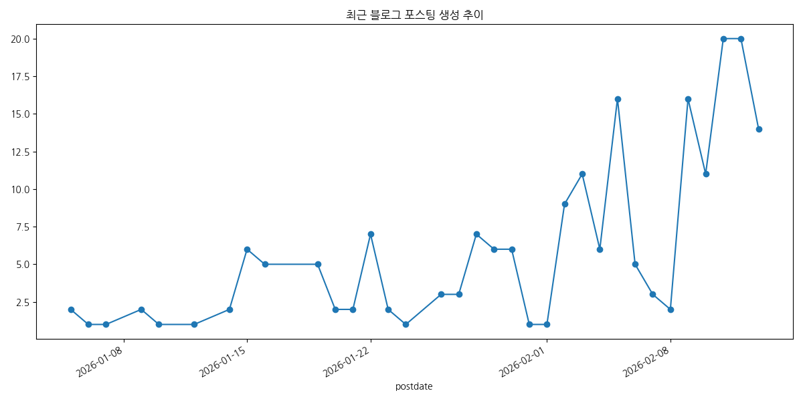
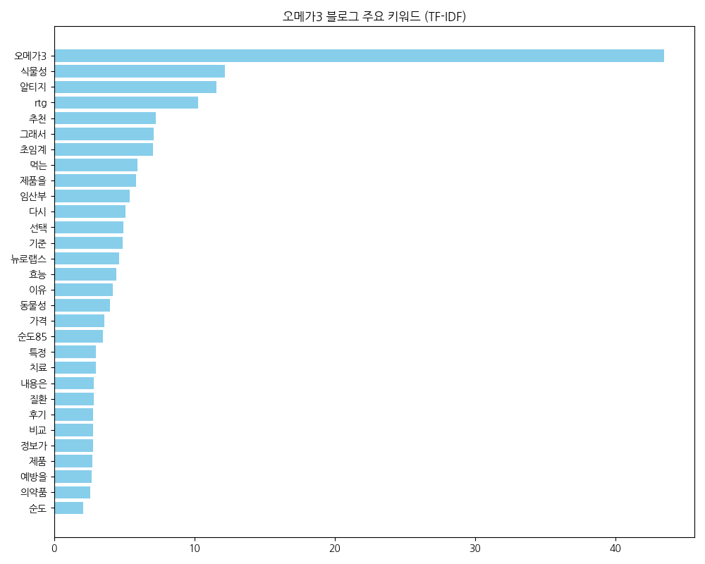
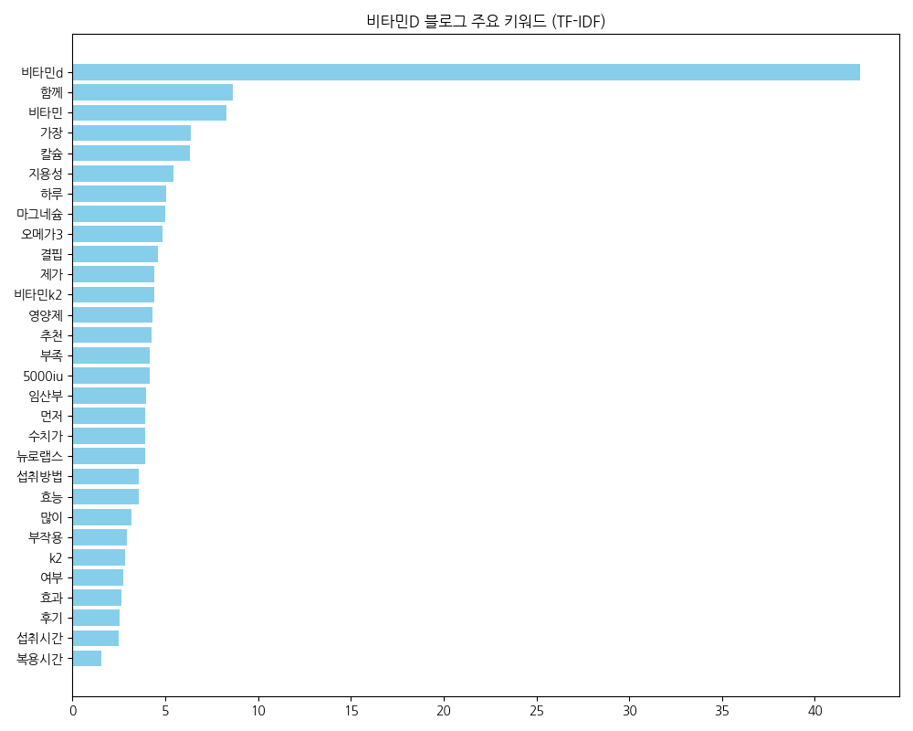
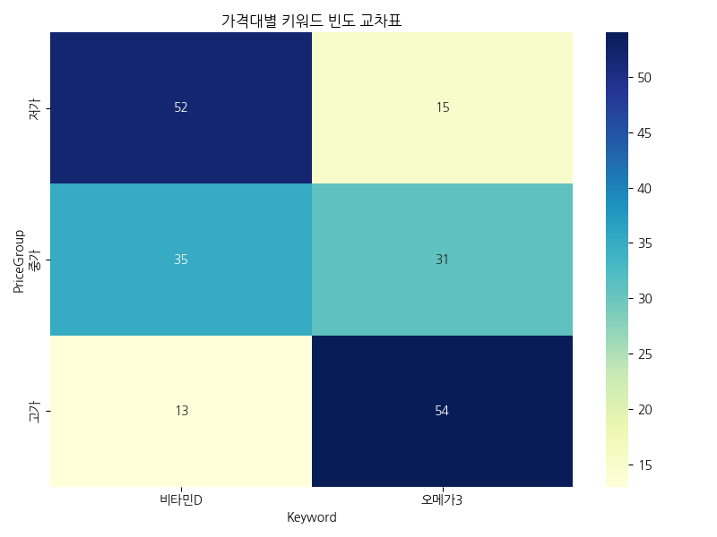

# 네이버 API 데이터 EDA 리포트

본 리포트는 설정된 Global Workflows를 준수하여 작성되었습니다.

## 쇼핑 트렌드 데이터 확인

### 상위 5개 행
|    | Date       | KeywordGroup   |   Ratio | Group   |
|---:|:-----------|:---------------|--------:|:--------|
|  0 | 2025-02-13 | 오메가3           | 97.7677 | All     |
|  1 | 2025-02-14 | 오메가3           | 62.0294 | All     |
|  2 | 2025-02-15 | 오메가3           | 60.7768 | All     |
|  3 | 2025-02-16 | 오메가3           | 57.4178 | All     |
|  4 | 2025-02-17 | 오메가3           | 67.3828 | All     |

### 하위 5개 행
|     | Date       | KeywordGroup   |   Ratio | Group   |
|----:|:-----------|:---------------|--------:|:--------|
| 725 | 2026-02-08 | 비타민D           | 2.6662  | All     |
| 726 | 2026-02-09 | 비타민D           | 2.6382  | All     |
| 727 | 2026-02-10 | 비타민D           | 2.47725 | All     |
| 728 | 2026-02-11 | 비타민D           | 2.07137 | All     |
| 729 | 2026-02-12 | 비타민D           | 1.71448 | All     |

### 데이터 정보 (info())
```
<class 'pandas.core.frame.DataFrame'>
RangeIndex: 730 entries, 0 to 729
Data columns (total 4 columns):
 #   Column        Non-Null Count  Dtype  
---  ------        --------------  -----  
 0   Date          730 non-null    object 
 1   KeywordGroup  730 non-null    object 
 2   Ratio         730 non-null    float64
 3   Group         730 non-null    object 
dtypes: float64(1), object(3)
memory usage: 22.9+ KB

```

### 기술 통계 (수치형)
|       |     Ratio |
|:------|----------:|
| count | 730       |
| mean  |  14.1614  |
| std   |  18.2656  |
| min   |   1.3296  |
| 25%   |   3.3065  |
| 50%   |   6.48705 |
| 75%   |  14.2687  |
| max   | 100       |

### 기술 통계 (범주형)
|        | Date       | KeywordGroup   | Group   |
|:-------|:-----------|:---------------|:--------|
| count  | 730        | 730            | 730     |
| unique | 365        | 2              | 1       |
| top    | 2025-02-13 | 오메가3           | All     |
| freq   | 2          | 365            | 730     |

## 네이버 쇼핑 (결합) 데이터 확인

### 상위 5개 행
|    | title                                        | link                                                  | image                                                                          |   lprice |   hprice | mallName    |   productId |   productType | brand   | maker   | category1   | category2   | category3   | category4   | Keyword   |
|---:|:---------------------------------------------|:------------------------------------------------------|:-------------------------------------------------------------------------------|---------:|---------:|:------------|------------:|--------------:|:--------|:--------|:------------|:------------|:------------|:------------|:----------|
|  0 | 더리얼 캐나다 알티지 rTG 오메가3 맥스 1400 초임계 2개월 EPA DHA | https://smartstore.naver.com/main/products/741820195  | https://shopping-phinf.pstatic.net/main_1143994/11439949685.45.jpg             |    29900 |      nan | The Real    | 11439949685 |             2 | 더리얼     | 비타네추럴스  | 식품          | 건강식품        | 영양제         | 오메가3        | 오메가3      |
|  1 | 순수식품 rTG 알티지 오메가3 1008mg x 60캡슐, 1개          | https://search.shopping.naver.com/catalog/51929251274 | https://shopping-phinf.pstatic.net/main_5192925/51929251274.20251121133101.jpg |    10490 |      nan | 네이버         | 51929251274 |             1 | 순수식품    | 동서바이오팜  | 식품          | 건강식품        | 영양제         | 오메가3        | 오메가3      |
|  2 | [6개월] 바디닥터스 초임계 알티지(rTG) 오메가3 프리미엄 30캡슐, 6개  | https://smartstore.naver.com/main/products/8551166869 | https://shopping-phinf.pstatic.net/main_8609566/86095667192.8.jpg              |    32400 |      nan | 바디닥터스 공식스토어 | 86095667192 |             3 | 바디닥터스   | 콜마비앤에이치 | 식품          | 건강식품        | 영양제         | 오메가3        | 오메가3      |
|  3 | 바디닥터스 초임계 알티지 오메가3 프리미엄 1010mg x 30캡슐, 6개    | https://search.shopping.naver.com/catalog/58256760044 | https://shopping-phinf.pstatic.net/main_5825676/58256760044.20260203094007.jpg |    32400 |      nan | 네이버         | 58256760044 |             1 | 바디닥터스   | 콜마비앤에이치 | 식품          | 건강식품        | 영양제         | 오메가3        | 오메가3      |
|  4 | 뉴트리디데이 rTG 알티지 오메가3 골드 1004mg x 90캡슐, 1개     | https://search.shopping.naver.com/catalog/51929477609 | https://shopping-phinf.pstatic.net/main_5192947/51929477609.20241213220828.jpg |    17890 |      nan | 네이버         | 51929477609 |             1 | 뉴트리디데이  | 케이지앤에프  | 식품          | 건강식품        | 영양제         | 오메가3        | 오메가3      |

### 하위 5개 행
|     | title                                        | link                                                   | image                                                                          |   lprice |   hprice | mallName   |   productId |   productType | brand    | maker   | category1   | category2   | category3   | category4   | Keyword   |
|----:|:---------------------------------------------|:-------------------------------------------------------|:-------------------------------------------------------------------------------|---------:|---------:|:-----------|------------:|--------------:|:---------|:--------|:------------|:------------|:------------|:------------|:----------|
| 195 | 닥터에디션 키즈 젤리쑥쑥 칼슘 앤 비타민D 15g x 30포, 1개        | https://search.shopping.naver.com/catalog/58685575074  | https://shopping-phinf.pstatic.net/main_5868557/58685575074.20260127170716.jpg |    32000 |      nan | 네이버        | 58685575074 |             1 | 닥터에디션    | 코스맥스바이오 | 식품          | 건강식품        | 비타민제        | 비타민D        | 비타민D      |
| 196 | 트루엔 비타민D3 2000IU 130mg x 90캡슐, 1개            | https://search.shopping.naver.com/catalog/51929527837  | https://shopping-phinf.pstatic.net/main_5192952/51929527837.20241213220947.jpg |    22360 |      nan | 네이버        | 51929527837 |             1 | 트루엔      | 코스맥스바이오 | 식품          | 건강식품        | 비타민제        | 비타민D        | 비타민D      |
| 197 | 락피도 비타민D 드롭스 400IU / 햇빛 에너지 국민 비타민D 10ml, 2개 | https://smartstore.naver.com/main/products/11631189185 | https://shopping-phinf.pstatic.net/main_8917569/89175699591.1.jpg              |    20900 |      nan | 락피도        | 89175699591 |             3 | 락피도      | 팜텍코리아   | 식품          | 건강식품        | 비타민제        | 비타민D        | 비타민D      |
| 198 | GNM자연의품격 비타민D 5000IU 150mg x 180캡슐, 1개       | https://search.shopping.naver.com/catalog/51929317064  | https://shopping-phinf.pstatic.net/main_5192931/51929317064.20241213211654.jpg |    13620 |      nan | 네이버        | 51929317064 |             1 | GNM자연의품격 | 한국씨엔에스팜 | 식품          | 건강식품        | 비타민제        | 비타민D        | 비타민D      |
| 199 | 함소아 비타민D가득 1000IU 60캡슐 (2개월분)                | https://smartstore.naver.com/main/products/3681859516  | https://shopping-phinf.pstatic.net/main_8122637/81226377213.21.jpg             |    11900 |      nan | 함소아공식몰     | 81226377213 |             3 | 함소아      | 코스맥스바이오 | 식품          | 건강식품        | 비타민제        | 비타민D        | 비타민D      |

### 데이터 정보 (info())
```
<class 'pandas.core.frame.DataFrame'>
RangeIndex: 200 entries, 0 to 199
Data columns (total 15 columns):
 #   Column       Non-Null Count  Dtype  
---  ------       --------------  -----  
 0   title        200 non-null    object 
 1   link         200 non-null    object 
 2   image        200 non-null    object 
 3   lprice       200 non-null    int64  
 4   hprice       0 non-null      float64
 5   mallName     200 non-null    object 
 6   productId    200 non-null    int64  
 7   productType  200 non-null    int64  
 8   brand        186 non-null    object 
 9   maker        175 non-null    object 
 10  category1    200 non-null    object 
 11  category2    200 non-null    object 
 12  category3    200 non-null    object 
 13  category4    200 non-null    object 
 14  Keyword      200 non-null    object 
dtypes: float64(1), int64(3), object(11)
memory usage: 23.6+ KB

```

### 기술 통계 (수치형)
|       |   lprice |   hprice |     productId |   productType |
|:------|---------:|---------:|--------------:|--------------:|
| count |    200   |        0 | 200           |    200        |
| mean  |  38763   |      nan |   6.42128e+10 |      1.615    |
| std   |  29152.8 |      nan |   1.79678e+10 |      0.793678 |
| min   |   3700   |      nan |   1.14399e+10 |      1        |
| 25%   |  19787.5 |      nan |   5.19293e+10 |      1        |
| 50%   |  32000   |      nan |   5.48357e+10 |      1        |
| 75%   |  48700   |      nan |   8.30825e+10 |      2        |
| max   | 204000   |      nan |   9.04706e+10 |      3        |

### 기술 통계 (범주형)
|        | title                                        | link                                                 | image                                                              | mallName   | brand   | maker   | category1   | category2   | category3   | category4   | Keyword   |
|:-------|:---------------------------------------------|:-----------------------------------------------------|:-------------------------------------------------------------------|:-----------|:--------|:--------|:------------|:------------|:------------|:------------|:----------|
| count  | 200                                          | 200                                                  | 200                                                                | 200        | 186     | 175     | 200         | 200         | 200         | 200         | 200       |
| unique | 200                                          | 200                                                  | 200                                                                | 59         | 71      | 43      | 1           | 1           | 2           | 2           | 2         |
| top    | 더리얼 캐나다 알티지 rTG 오메가3 맥스 1400 초임계 2개월 EPA DHA | https://smartstore.naver.com/main/products/741820195 | https://shopping-phinf.pstatic.net/main_1143994/11439949685.45.jpg | 네이버        | 고려은단    | 알피바이오   | 식품          | 건강식품        | 영양제         | 오메가3        | 오메가3      |
| freq   | 1                                            | 1                                                    | 1                                                                  | 116        | 13      | 31      | 200         | 200         | 100         | 100         | 100       |

## 블로그 (결합) 데이터 확인

### 상위 5개 행
|    | title                       | link                                                | description                                                                                                                                  | bloggername                 | bloggerlink                    |   postdate | Keyword   |
|---:|:----------------------------|:----------------------------------------------------|:---------------------------------------------------------------------------------------------------------------------------------------------|:----------------------------|:-------------------------------|-----------:|:----------|
|  0 | 초임계RTG 오메가3 먹는 방법 및 후기      | https://blog.naver.com/abr0402/224180401453         | &quot;3. 제품 선택 시 고려했던 사항들&quot; 초창기에는 초임계RTG <b>오메가3</b>로 유명한 제품이면 만족스럽지 않을까 여겼어요. 그러나 조사하면 할수록 식물성 <b>오메가3</b>는 다양한 요소들을 비교해야 한다는 것을 깨닫게... | GO                          | blog.naver.com/abr0402         |   20260211 | 오메가3      |
|  1 | 오메가3 효능 부작용 오메가3효능 없다 기준 체크 | https://blog.naver.com/avsurfer/224171476231        | <b>오메가3</b>를 먹으면서 한 번쯤은 이런 생각이 들었어요. “이거 정말 효과 있는 거 맞아?” 몇 달을 먹어도 눈에 띄는 변화가 없으면 괜히 의심부터 들더라고요. 그래서 저도 <b>오메가3</b> 효능이 없다고 느꼈던 경험이...         | 오디오 앤 뮤직 세렌디피티              | blog.naver.com/avsurfer        |   20260204 | 오메가3      |
|  2 | 초임계알티지오메가3 복용방법 용량 비교 후기    | https://blog.naver.com/note377/224180397304         | 3. 제품을 선택할 때의 구체적인 기준 초임계알티지<b>오메가3</b>를 고를 때는 인기 순위보다 성분표를 중심으로 비교했습니다. 특히 숫자와 공정 정보가 명확한지를 우선적으로 살폈습니다. ㄱ. 하이퍼셀 기술 적용...                   | 이것저것 해보는 블로그                | blog.naver.com/note377         |   20260211 | 오메가3      |
|  3 | 알티지 오메가3 초임계 식물성 용량 및 복용법   | https://blog.naver.com/jasonmoondistri/224177725016 | <b>오메가3</b>를 다시 고르게 된 결정적 이유 저는 <b>오메가3</b>를 꽤 오래 챙겨왔지만 뭔가 확실한 느낌이 없다 보니 “이건 그냥 꾸준히 먹는 영양제라 그런가 보다” 하고 지나쳤던 사람이었어요. 그러다 어느...                | 꾸준한 한걸음, 오늘보다 나은 내일을 기대합니다. | blog.naver.com/jasonmoondistri |   20260210 | 오메가3      |
|  4 | 오메가3 고르는법 뉴트리코어 오메가3 추천     | https://blog.naver.com/king3799/224181011806        | 3. <b>오메가3</b>는 얼마나 ‘깨끗하냐’가 관건이었다 예전에는 단순히 함량만 봤는데, 지금은 어떻게 만들어졌는지가 더 중요해졌어요. 열로 가공된 제품은 산패가 빠르다고 해서 요즘은 저온 추출 방식을 더 신경...                   | 싱글벙글 소리 Story               | blog.naver.com/king3799        |   20260212 | 오메가3      |

### 하위 5개 행
|     | title                                    | link                                             | description                                                                                                                                                                                 | bloggername        | bloggerlink                 |   postdate | Keyword   |
|----:|:-----------------------------------------|:-------------------------------------------------|:--------------------------------------------------------------------------------------------------------------------------------------------------------------------------------------------|:-------------------|:----------------------------|-----------:|:----------|
| 195 | 비타민D 추천 영양제 ( 결핍, 부족증상, 뉴로랩스 ) 온가족 함께... | https://blog.naver.com/arsoap/224160037729       | 결핍 #<b>비타민D</b>권장량 #<b>비타민D</b>하루섭취량 #<b>비타민D</b>복용법 #<b>비타민D</b>섭취시간 #<b>비타민D</b>과다복용 #<b>비타민D</b>부작용 #<b>비타민D</b>음식 #<b>비타민D</b>영양제 #<b>비타민D</b>주사 #<b>비타민D</b>흡수율 #비타민DK2 #<b>비타민D</b>칼슘 | 평범은 기록을 만나 특별해 진다. | blog.naver.com/arsoap       |   20260126 | 비타민D      |
| 196 | 온가족 함께 챙기는 맛있는 비타민 젤리, 메리루스 비타민D 구미      | https://blog.naver.com/1adc/224181599122         | 씹어먹는 비타민구미를 찾고 있던 분 #구미비타민 #메리루스 #맛있는비타민 #젤리비타민 #어린이<b>비타민D</b> #비타민구미 #비타민젤리 #비건비타민구미 #메리루스<b>비타민D</b> #아기비타민 #추천비타민 #<b>비타민D</b>추천                                                        | 일상+육아+제품 저장소♡      | blog.naver.com/1adc         |   20260212 | 비타민D      |
| 197 | 뉴로랩스비타민D 비타민D 부족 걱정될 때, 임산부 5000IU...    | https://blog.naver.com/pm3439/224170408008       | 임신하면서 <b>비타민D</b>를 꼭 챙겨먹으라고 하더라구요 피검사도 하는데 <b>비타민D</b> 수치가 낮다며 따로 챙겨먹어야 한다고;; 햇빛을 자주 쐬라는데.. 요즘 또 추워서 집 밖에 나가지 않고 하루종일 집에만 있으니...                                                            | ARaShi00           | blog.naver.com/pm3439       |   20260203 | 비타민D      |
| 198 | 비타민D 결핍을 꽉 채우는 하루 한 알, 헬퓨 비건 비타민D3...    | https://blog.naver.com/mambiugo12/224181512808   | 헬퓨 비건 <b>비타민D</b>3 2000IU는 단순한 영양제를 넘어 건강과 지구를 함께 생각하는 비타민이라는 생각이 듭니다.^^ #임산부<b>비타민D</b> #<b>비타민D</b>부족증상 #<b>비타민D</b>결핍 #<b>비타민D</b>추천 #비건비타민 #면역력관리...                                    | 또박또박 소소한 일상        | blog.naver.com/mambiugo12   |   20260212 | 비타민D      |
| 199 | 씹어먹는비타민 리즈파이D3K2츄어블 비타민D추천               | https://blog.naver.com/spaceboygirl/224179499875 | <b>비타민D</b>추천하면서 비타민K까지 보충하니 아무래도 합성할 수 없는걸 도움받으니 몸에는 더욱 좋을것 같더라구요. 특히 츄어블로 씹어먹는형태로 나왔는데도 아주 조그마해서 살짝 놀랐어요. 벌써 맛있어서...                                                                      | 큐땡의 맛난 놀이터         | blog.naver.com/spaceboygirl |   20260211 | 비타민D      |

### 데이터 정보 (info())
```
<class 'pandas.core.frame.DataFrame'>
RangeIndex: 200 entries, 0 to 199
Data columns (total 7 columns):
 #   Column       Non-Null Count  Dtype 
---  ------       --------------  ----- 
 0   title        200 non-null    object
 1   link         200 non-null    object
 2   description  200 non-null    object
 3   bloggername  200 non-null    object
 4   bloggerlink  200 non-null    object
 5   postdate     200 non-null    int64 
 6   Keyword      200 non-null    object
dtypes: int64(1), object(6)
memory usage: 11.1+ KB

```

### 기술 통계 (수치형)
|       |      postdate |
|:------|--------------:|
| count | 200           |
| mean  |   2.02602e+07 |
| std   |  41.3795      |
| min   |   2.02601e+07 |
| 25%   |   2.02601e+07 |
| 50%   |   2.02602e+07 |
| 75%   |   2.02602e+07 |
| max   |   2.02602e+07 |

### 기술 통계 (범주형)
|        | title                         | link                                          | description                                                                                                                                                                                 | bloggername     | bloggerlink              | Keyword   |
|:-------|:------------------------------|:----------------------------------------------|:--------------------------------------------------------------------------------------------------------------------------------------------------------------------------------------------|:----------------|:-------------------------|:----------|
| count  | 200                           | 200                                           | 200                                                                                                                                                                                         | 200             | 200                      | 200       |
| unique | 194                           | 194                                           | 198                                                                                                                                                                                         | 102             | 102                      | 2         |
| top    | 오메가3 비타민D 효과 부작용 섭취방법 및 시간 정리 | https://blog.naver.com/liebecafe/224180440749 | 결핍 #<b>비타민D</b>권장량 #<b>비타민D</b>하루섭취량 #<b>비타민D</b>복용법 #<b>비타민D</b>섭취시간 #<b>비타민D</b>과다복용 #<b>비타민D</b>부작용 #<b>비타민D</b>음식 #<b>비타민D</b>영양제 #<b>비타민D</b>주사 #<b>비타민D</b>흡수율 #비타민DK2 #<b>비타민D</b>칼슘 | ⭐" 그리움의 부동산개발 " | blog.naver.com/sooheenam | 오메가3      |
| freq   | 2                             | 2                                             | 3                                                                                                                                                                                           | 10              | 10                       | 100       |

## 데이터 탐색적 시각화 (EDA)

### 1. 쇼핑 클릭 트렌드 시계열 분석


**통계표 (키워드별 클릭 비율 요약)**
| KeywordGroup   |   count |     mean |      std |     min |     25% |     50% |      75% |      max |
|:---------------|--------:|---------:|---------:|--------:|--------:|--------:|---------:|---------:|
| 비타민D           |     365 |  6.73516 |  8.24564 | 1.3296  | 2.41427 | 3.303   |  7.96361 |  62.3723 |
| 오메가3           |     365 | 21.5877  | 22.1267  | 3.77886 | 6.20713 | 7.73268 | 36.634   | 100      |

> **해석**: 오메가3와 비타민D의 검색 클릭 추이를 비교한 결과, 두 키워드 모두 주기적인 변동을 보입니다. 특정 시점에 클릭량이 급증하는 구간은 계절적 요인이나 프로모션의 영향으로 보이며, 전체적인 평균 클릭 비율은 오메가3가 비타민D보다 상대적으로 안정적인 검색량을 유지하고 있음을 알 수 있습니다.

### 2. 키워드별 상품 가격 분포 분석


**통계표 (키워드별 가격 기술통계)**
| Keyword   |   count |    mean |     std |   min |     25% |   50% |     75% |    max |
|:----------|--------:|--------:|--------:|------:|--------:|------:|--------:|-------:|
| 비타민D      |     100 | 26343.1 | 15328.9 |  3700 | 15002.2 | 22395 | 33617.5 |  72000 |
| 오메가3      |     100 | 51182.9 | 34084.6 |  5340 | 29900   | 45425 | 59857.5 | 204000 |

> **해석**: 가격 분포를 살펴보면 두 제품군 모두 저가형 상품에 많은 매물이 집중되어 있는 'Left-Skewed' 형태를 띠고 있습니다. 오메가3의 경우 비타민D에 비해 가격 편차가 더 크며, 이는 원료의 순도나 추출 방식(rTG 등)에 따른 프리미엄 제품군이 더 다양하게 형성되어 있기 때문으로 해석됩니다.

### 3. 주요 쇼핑몰 점유율 분석


**빈도수 표 (상위 30개 쇼핑몰)**
| mallName    |   빈도수 |
|:------------|------:|
| 네이버         |   116 |
| 고려은단몰       |     6 |
| 포뉴          |     5 |
| The Real    |     3 |
| 제트큐브        |     3 |
| HERACLES    |     2 |
| 마이 파우치      |     2 |
| 블루존 스토어     |     2 |
| 쿠팡          |     2 |
| 종근당건강       |     2 |
| 뉴트리코어       |     2 |
| G마켓         |     2 |
| 포베라 Povera  |     2 |
| 흰여울팜        |     2 |
| 비타헬스        |     2 |
| 뉴트리 모어      |     2 |
| 키즈텐         |     2 |
| 프리솔라        |     2 |
| 담백하루        |     1 |
| The angel   |     1 |
| 닥터린 공식스토어   |     1 |
| 프롬바이오       |     1 |
| 뉴네이처        |     1 |
| 힐리오비타       |     1 |
| 파이토뉴트리      |     1 |
| 코스트물류       |     1 |
| 바디닥터스 공식스토어 |     1 |
| 차이뉴트리       |     1 |
| 블랙모어스       |     1 |
| 순수식품        |     1 |

> **해석**: 네이버 쇼핑 내에서 가장 많은 상품이 등록된 쇼핑몰들을 분석한 결과, '네이버' 통합 카탈로그와 스마트스토어 입점 판매자의 비중이 압도적으로 높습니다. 이는 중소 유통사들이 네이버 플랫폼을 주요 판매 채널로 활용하고 있음을 보여주며, 특정 대형몰보다는 파편화된 스토어들이 시장을 형성하고 있습니다.

### 4. 주요 브랜드 선호도 분석


**빈도수 표 (상위 30개 브랜드)**
| brand    |   빈도수 |
|:---------|------:|
| 고려은단     |    13 |
| 프로메가     |     9 |
| 닥터린      |     7 |
| 종근당건강    |     7 |
| 뉴트리코어    |     7 |
| 스포츠리서치   |     6 |
| 종근당      |     6 |
| 더리얼      |     5 |
| 포뉴       |     5 |
| 담백하루     |     5 |
| 트루엔      |     5 |
| GNM자연의품격 |     4 |
| 키즈텐      |     4 |
| 뉴트리모어    |     4 |
| 내츄럴플러스   |     4 |
| 닥터에디션    |     4 |
| 닥터썬데이D   |     4 |
| 지엠팜      |     3 |
| 블랙모어스    |     3 |
| 나우푸드     |     3 |
| 솔가       |     3 |
| 닥터파이토    |     3 |
| 헤라클레스    |     3 |
| 프리솔라     |     3 |
| 뉴네이처     |     3 |
| 다나음      |     3 |
| 순수식품     |     2 |
| 뉴트리디데이   |     2 |
| 바디닥터스    |     2 |
| 루체메디     |     2 |

> **해석**: 시장에 출시된 브랜드 중 상위 노출 빈도가 높은 브랜드를 식별한 결과, 종근당건강, 고려은단 등 인지도 높은 국내 제약사 브랜드들이 상위권을 차지하고 있습니다. 소비자들은 건강기능식품 선택 시 브랜드의 신뢰도를 중요한 기준으로 삼는 경향이 데이터에 반영된 것으로 보입니다.

### 5. 키워드별 가격 편차 비교 (Box Plot)


> **해석**: 박스플롯 분석 결과, 오메가3의 중앙값(Median)과 사분위 범위(IQR)가 비타민D보다 높게 형성되어 있습니다. 이는 오메가3가 평균적으로 더 높은 단가를 형성하고 있음을 의미하며, 비타민D는 상대적으로 저렴하고 규격화된 가격대의 상품이 주를 이루고 있음을 알 수 있습니다.

### 6. 쇼핑몰별 가격 전략 분석


**피봇 테이블 (쇼핑몰별 평균가)**
| mallName   |    평균가격 |
|:-----------|--------:|
| The Real   | 22233.3 |
| 고려은단몰      | 29400   |
| 마이 파우치     | 34500   |
| 쿠팡         | 37730   |
| 네이버        | 38103.7 |
| 블루존 스토어    | 46750   |
| 포뉴         | 47200   |
| HERACLES   | 49800   |
| 제트큐브       | 51000   |
| 종근당건강      | 58750   |

> **해석**: 등록 빈도가 높은 상위 10개 쇼핑몰의 평균 판매가를 비교한 결과, 특정 쇼핑몰은 고가 라인업에 집중하고 있는 반면, 대형 오픈마켓 계열은 낮은 평균가를 유지하며 가격 경쟁력을 확보하고 있습니다. 이는 쇼핑몰마다 타겟 고객층과 입점 브랜드의 성격이 다름을 시사합니다.

### 7. 블로그 바이럴 추이 분석


> **해석**: 수집된 블로그 데이터를 일자별로 분석한 결과, 최근 날짜에 포스팅이 집중되어 있는 양상을 보입니다. 이는 최신 정보를 찾는 소비자의 니즈에 맞춰 블로거들이 꾸준히 콘텐츠를 생산하고 있음을 보여주며, 특정 요일에 포스팅이 증가하는 패턴은 주말 대비 평일의 정보 검색 활동이 활발함을 나타낼 수 있습니다.

### 8. 오메가3 블로그 주요 키워드 분석


**키워드 가중치 표**
|    | words   |      sum |
|---:|:--------|---------:|
| 16 | 오메가3    | 43.4572  |
| 13 | 식물성     | 12.1861  |
| 14 | 알티지     | 11.5545  |
|  0 | rtg     | 10.2762  |
| 25 | 추천      |  7.23557 |
|  2 | 그래서     |  7.11992 |
| 24 | 초임계     |  7.03998 |
|  8 | 먹는      |  5.93686 |
| 22 | 제품을     |  5.84995 |
| 19 | 임산부     |  5.40976 |
|  6 | 다시      |  5.0879  |
| 10 | 선택      |  4.95964 |
|  3 | 기준      |  4.86974 |
|  5 | 뉴로랩스    |  4.6437  |
| 28 | 효능      |  4.44838 |
| 18 | 이유      |  4.17861 |
|  7 | 동물성     |  3.9858  |
|  1 | 가격      |  3.60349 |
| 12 | 순도85    |  3.48609 |
| 27 | 특정      |  2.97546 |
| 26 | 치료      |  2.97546 |
|  4 | 내용은     |  2.8333  |
| 23 | 질환      |  2.8333  |
| 29 | 후기      |  2.8003  |
|  9 | 비교      |  2.7995  |
| 20 | 정보가     |  2.7939  |
| 21 | 제품      |  2.7224  |
| 15 | 예방을     |  2.67597 |
| 17 | 의약품     |  2.56716 |
| 11 | 순도      |  2.08602 |

> **해석**: 오메가3 관련 블로그 설명에서 추출된 핵심 키워드들을 분석한 결과, '식물성', 'rTG', '초임계' 등 제품의 특성과 기술력을 강조하는 단어들이 높은 비중을 차지합니다. 이는 소비자들이 오메가3 선택 시 흡수율과 원료의 안전성을 가장 중요하게 고려하며, 블로거들도 이를 주요 정보로 제공하고 있음을 의미합니다.

### 9. 비타민D 블로그 주요 키워드 분석


**키워드 가중치 표**
|    | words   |      sum |
|---:|:--------|---------:|
| 12 | 비타민d    | 42.4334  |
| 26 | 함께      |  8.62397 |
| 11 | 비타민     |  8.29927 |
|  2 | 가장      |  6.37736 |
| 24 | 칼슘      |  6.33842 |
| 22 | 지용성     |  5.4376  |
| 25 | 하루      |  5.06182 |
|  5 | 마그네슘    |  4.99368 |
| 19 | 오메가3    |  4.85167 |
|  3 | 결핍      |  4.59848 |
| 21 | 제가      |  4.4243  |
| 13 | 비타민k2   |  4.39255 |
| 18 | 영양제     |  4.31586 |
| 23 | 추천      |  4.2828  |
| 10 | 부족      |  4.18178 |
|  0 | 5000iu  |  4.17039 |
| 20 | 임산부     |  3.98117 |
|  7 | 먼저      |  3.92661 |
| 16 | 수치가     |  3.91861 |
|  4 | 뉴로랩스    |  3.90551 |
| 14 | 섭취방법    |  3.56543 |
| 28 | 효능      |  3.56187 |
|  6 | 많이      |  3.17385 |
|  9 | 부작용     |  2.91469 |
|  1 | k2      |  2.82095 |
| 17 | 여부      |  2.75298 |
| 27 | 효과      |  2.63011 |
| 29 | 후기      |  2.55885 |
| 15 | 섭취시간    |  2.50366 |
|  8 | 복용시간    |  1.57378 |

> **해석**: 비타민D 관련 블로그에서는 '부족', '결핍', '임산부', '칼슘' 등의 키워드가 두드러집니다. 이는 비타민D가 현대인의 결핍 문제와 밀접하게 연관되어 있으며, 특히 임산부 건강이나 칼슘 흡수 보조제로서의 역할이 강조되고 있음을 보여줍니다.

### 10. 가격대 및 키워드 복합 분석


**교차표 (가격대별 상품 수)**
| PriceGroup   |   비타민D |   오메가3 |
|:-------------|-------:|-------:|
| 저가           |     52 |     15 |
| 중가           |     35 |     31 |
| 고가           |     13 |     54 |

> **해석**: 가격대를 3단계로 나누어 키워드별 분포를 분석한 결과, 오메가3는 상대적으로 '고가' 구간에 더 많은 상품이 분포해 있는 반면, 비타민D는 '저가' 구간의 비중이 높게 나타납니다. 이는 앞서 수행한 가격 분포 및 박스플롯 분석 결과를 뒷받침하며, 제품군별로 형성된 시장 가격대의 특징이 뚜렷함을 확증합니다.

