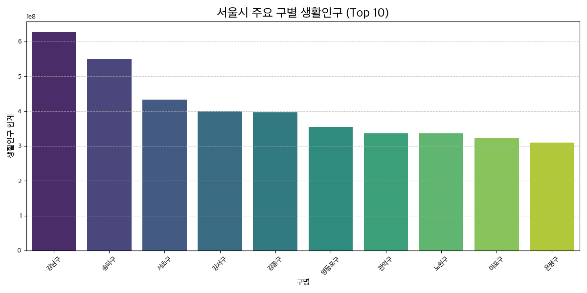
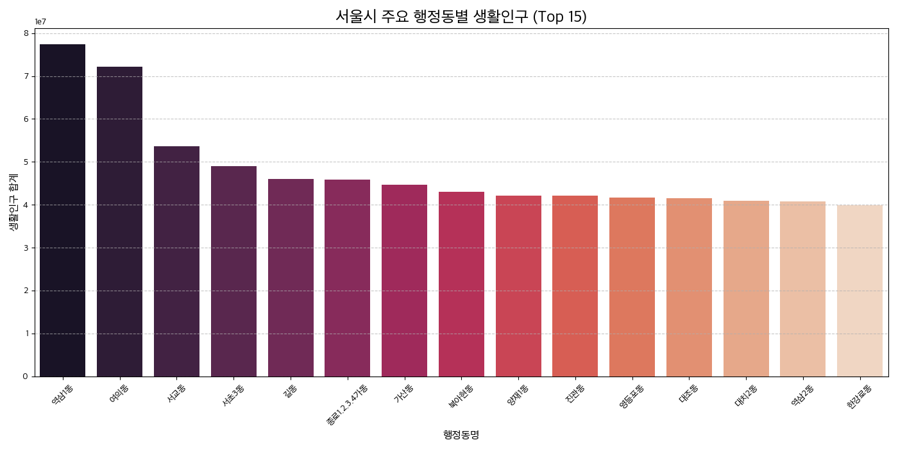
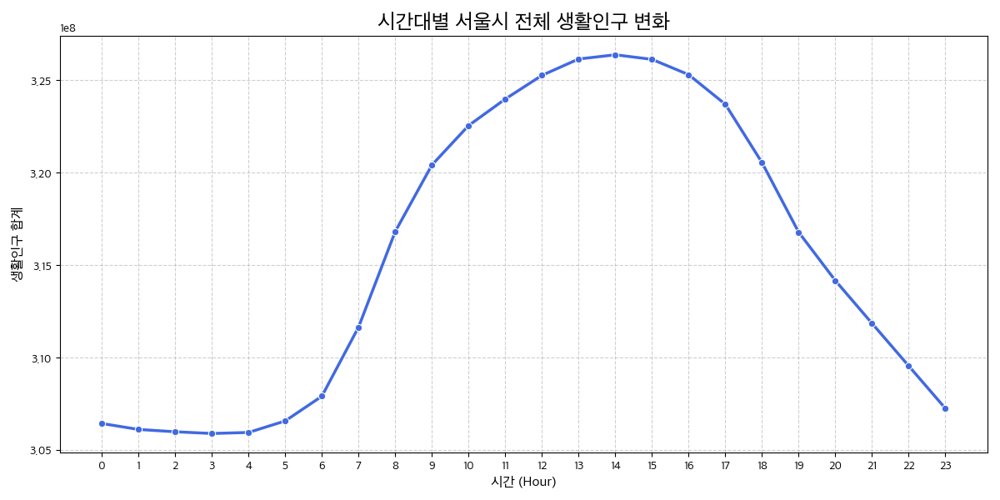
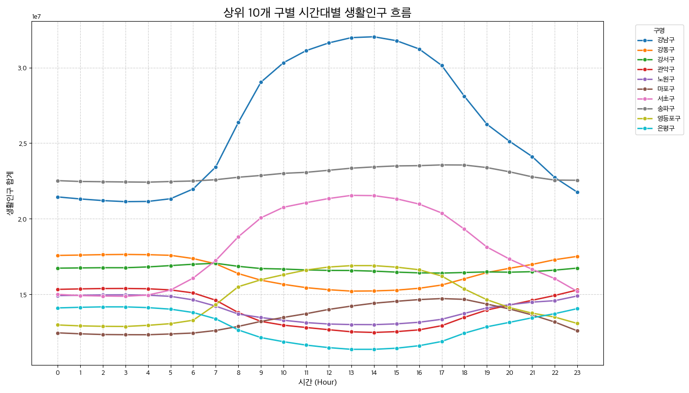
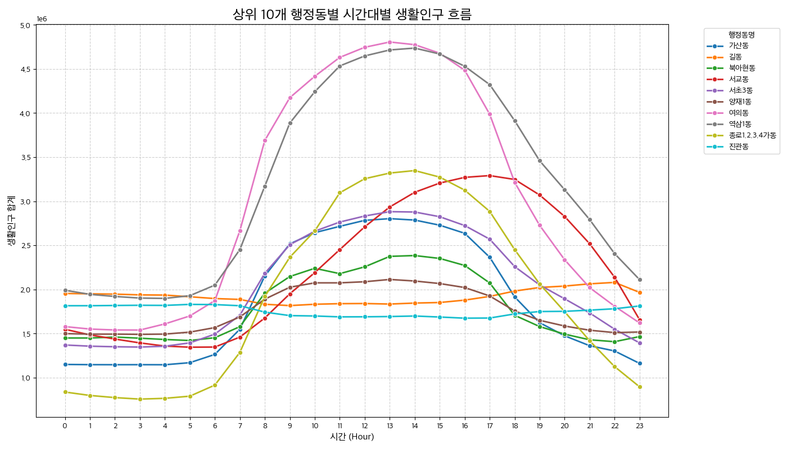
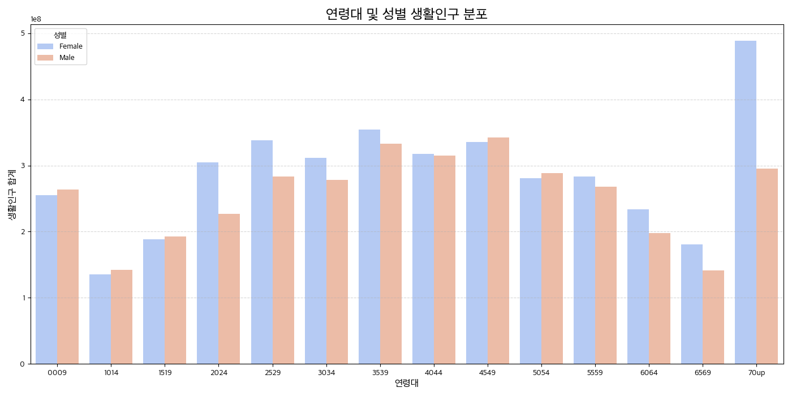

# 서울 생활인구 데이터 탐색적 분석 (EDA) 리포트

## 📊 1. 데이터 포맷 및 효율성 확인
기존 CSV 포맷에서 Parquet 포맷으로 변환한 결과, 데이터 저장 효율이 비약적으로 향상되었습니다.

- **CSV 파일 크기**: 613 MB (`seoul_pops_tidy_202601.csv`)
- **Parquet 파일 크기**: 129 MB (`seoul_pops_tidy.parquet`)
- **확인 결과**: Parquet 포맷이 CSV 대비 **약 79% 더 작음**을 확인했습니다. (파일 크기가 약 1/5 수준으로 감소)

---

## 🏗 2. 구별 생활인구 분석 (Top 10)
서울시 25개 구 중 생활인구가 가장 많은 상위 10개 지역입니다.

| 순위 | 구명 | 생활인구 합계 |
| :--- | :--- | :--- |
| 1 | **강남구** | 약 6.27억 명 |
| 2 | **송파구** | 약 5.50억 명 |
| 3 | **서초구** | 약 4.34억 명 |

> **Insight**: 강남 3구(강남, 송파, 서초)가 상위권을 차지하며 압도적인 유동 인구 및 생활 인구 밀집도를 보이고 있습니다.

---

## 🏘 3. 동별 생활인구 분석 (Top 15)
가장 활기찬 생활인구 분포를 보이는 행정동 상위 15곳입니다.

> **Insight**: 오피스 밀집 지역인 **역삼1동**과 **여의동**이 압도적 1, 2위를 차지하고 있으며, 상업 중심지인 서교동과 종로가 그 뒤를 잇고 있습니다.

---

## ⏰ 4. 시간대별 생활인구 흐름

### 4-1. 서울시 전체 시간대별 흐름
도시의 하루 리듬을 보여주는 시간대별 전체 생활인구 변화입니다.

- **최저 시간대**: 새벽 3~4시 (약 3.06억 명)
- **최고 시간대**: 오후 14시 (약 3.26억 명)

### 4-2. 상위 10개 구별 시간대별 흐름
생활인구가 가장 많은 10개 구의 시간대별 패턴을 비교한 결과입니다.

- **강남구**의 경우, 오전 8시부터 인구가 급증하여 업무 시간 내내 높은 수준을 유지하다가 퇴근 시간인 18시 이후 급격히 감소하는 전형적인 **업무 지구 패턴**을 보입니다.
- **송파구, 강서구, 강동구** 등 주거 비중이 높은 지역은 강남구에 비해 시간대별 변동 폭이 상대적으로 완만합니다.

### 4-3. 상위 10개 행정동별 시간대별 흐름
가장 생활인구가 많은 10개 행정동의 시간대별 변화입니다.

- **역삼1동**과 **여의동**은 낮 시간대(10시~17시)에 인구가 집중되는 피크가 매우 뚜렷합니다.
- 특히 **가산동**은 출퇴근 시간대의 유입 및 유출이 가장 급격하게 일어나는 산업 단지 특성을 잘 보여줍니다.

---

## 👥 5. 인구 통계적 특성 (연령 및 성별)
연령대와 성별에 따른 생활인구 구성 비율입니다.

- **성별 분포**: 여성이 약 40.1억 명(53%), 남성이 약 35.7억 명(47%)으로 여성이 다소 많습니다.
- **연령별 특성**: 사회 활동이 왕성한 **30대 후반(35-39세)**과 **40대 후반(45-49세)**, 그리고 인구 비중이 큰 **70세 이상** 그룹이 높은 비중을 차지합니다.

---
**보고서 생성 일자**: 2026-02-28
**데이터 소스**: 서울시 생활인구 (2026년 01월)
