# 서울 생활인구 데이터 탐색적 분석 (EDA) 리포트

## 📊 1. 데이터 포맷 및 효율성 확인
기존 CSV 포맷에서 Parquet 포맷으로 변환한 결과, 데이터 저장 효율이 비약적으로 향상되었습니다.

- **CSV 파일 크기**: 613 MB (`seoul_pops_tidy_202601.csv`)
- **Parquet 파일 크기**: 129 MB (`seoul_pops_tidy.parquet`)
- **확인 결과**: Parquet 포맷이 CSV 대비 **약 79% 더 작음**을 확인했습니다. (파일 크기가 약 1/5 수준으로 감소)

---

## 🏗 2. 구별 생활인구 분석 (Top 10)
서울시 25개 구 중 생활인구가 가장 많은 상위 10개 지역입니다.

| 순위 | 구명 | 생활인구 합계 |
| :--- | :--- | :--- |
| 1 | **강남구** | 약 6.27억 명 |
| 2 | **송파구** | 약 5.50억 명 |
| 3 | **서초구** | 약 4.34억 명 |

> **Insight**: 강남 3구(강남, 송파, 서초)가 상위권을 차지하며 압도적인 유동 인구 및 생활 인구 밀집도를 보이고 있습니다.

---

## 🏘 3. 동별 생활인구 분석 (Top 15)
가장 활기찬 생활인구 분포를 보이는 행정동 상위 15곳입니다.

> **Insight**: 오피스 밀집 지역인 **역삼1동**과 **여의동**이 압도적 1, 2위를 차지하고 있으며, 상업 중심지인 서교동과 종로가 그 뒤를 잇고 있습니다.

---

## ⏰ 4. 시간대별 생활인구 흐름

### 4-1. 서울시 전체 시간대별 흐름
도시의 하루 리듬을 보여주는 시간대별 전체 생활인구 변화입니다.

- **최저 시간대**: 새벽 3~4시 (약 3.06억 명)
- **최고 시간대**: 오후 14시 (약 3.26억 명)

### 4-2. 상위 10개 구별 시간대별 흐름
생활인구가 가장 많은 10개 구의 시간대별 패턴을 비교한 결과입니다.

- **강남구**의 경우, 오전 8시부터 인구가 급증하여 업무 시간 내내 높은 수준을 유지하다가 퇴근 시간인 18시 이후 급격히 감소하는 전형적인 **업무 지구 패턴**을 보입니다.
- **송파구, 강서구, 강동구** 등 주거 비중이 높은 지역은 강남구에 비해 시간대별 변동 폭이 상대적으로 완만합니다.

### 4-3. 상위 10개 행정동별 시간대별 흐름
가장 생활인구가 많은 10개 행정동의 시간대별 변화입니다.

- **역삼1동**과 **여의동**은 낮 시간대(10시~17시)에 인구가 집중되는 피크가 매우 뚜렷합니다.
- 특히 **가산동**은 출퇴근 시간대의 유입 및 유출이 가장 급격하게 일어나는 산업 단지 특성을 잘 보여줍니다.

---

## 👥 5. 인구 통계적 특성 (연령 및 성별)
연령대와 성별에 따른 생활인구 구성 비율입니다.

- **성별 분포**: 여성이 약 40.1억 명(53%), 남성이 약 35.7억 명(47%)으로 여성이 다소 많습니다.
- **연령별 특성**: 사회 활동이 왕성한 **30대 후반(35-39세)**과 **40대 후반(45-49세)**, 그리고 인구 비중이 큰 **70세 이상** 그룹이 높은 비중을 차지합니다.

---

## 📍 6. 주요 행정동 상세 분석 (Deep Dive)
특정 주요 지역(연남동, 성수동, 역삼동)에 대한 시간대별-연령별 생활인구 정밀 분석 결과입니다.

---

### 📍 연남동 상세 분석

#### [시간대별 흐름 및 인구 구조]
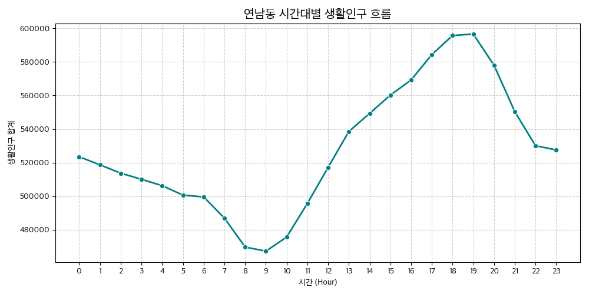
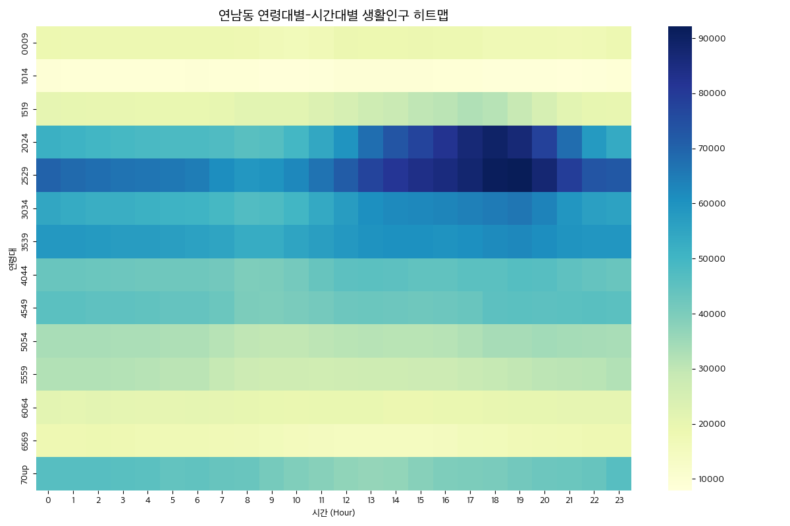

#### 기술통계 (시간대별 총 생활인구)
|           |   count |   mean |     std |    min |    25% |    50% |    75% |    max |
|:----------|--------:|-------:|--------:|-------:|-------:|-------:|-------:|-------:|
| pop_count |      24 | 527749 | 38498.6 | 467323 | 500439 | 521138 | 552835 | 596596 |

#### 시간대별 연령별 교차표 (2시간 간격 요약)
| age_group   |        0 |        2 |        4 |        6 |        8 |       10 |      12 |       14 |       16 |       18 |       20 |      22 |
|:------------|---------:|---------:|---------:|---------:|---------:|---------:|--------:|---------:|---------:|---------:|---------:|--------:|
| 0009        | 18498.6  | 18390.1  | 18250.4  | 18418.3  | 17831.2  | 16213.5  | 18814.7 | 18674    | 18341.4  | 17428.1  | 17240.8  | 17178.8 |
| 1014        |  8981.63 |  8926.87 |  8866.73 |  8948.41 |  8722.12 |  7950.68 |  9131.2 |  8965.09 |  8811.28 |  8394.61 |  8339.78 |  8322.7 |
| 1519        | 20509.3  | 19986.5  | 19710.1  | 19656.5  | 21456.2  | 21693.9  | 24843.2 | 28309.7  | 30827.7  | 31515.9  | 24820.6  | 20400.2 |
| 2024        | 52042.9  | 49881.4  | 48715.3  | 48300.1  | 45805.9  | 49731.9  | 59755   | 73435.2  | 82140.5  | 89412.7  | 78299.5  | 58080.8 |
| 2529        | 70323.4  | 67548.4  | 66235.2  | 64621.9  | 58721.4  | 62291.7  | 71546.8 | 81154.6  | 85529.6  | 91417.2  | 87583.9  | 73274.2 |
| 3034        | 54439.3  | 52117.4  | 51486.9  | 50524.3  | 47200.1  | 50077.5  | 57457   | 62032    | 63042.5  | 65135.5  | 63566.9  | 56625.9 |
| 3539        | 58632.8  | 58078    | 57439.1  | 56314.4  | 52720.1  | 55054.1  | 58468.4 | 60438.6  | 60133.4  | 61674.1  | 61176.4  | 58975.4 |
| 4044        | 43364.2  | 42876.7  | 42379.3  | 42235.1  | 39622.6  | 41355.1  | 45231.9 | 45146.5  | 44721    | 45733.7  | 46150.3  | 44119.9 |
| 4549        | 45733.2  | 45133.1  | 44678.4  | 43871.1  | 40048.1  | 40409.5  | 42745.9 | 42835.4  | 42730.2  | 45249.5  | 45326    | 45826.9 |
| 5054        | 33408.6  | 33306.6  | 33060.6  | 32835.7  | 30002.3  | 29866.9  | 31024.5 | 31016.8  | 31516.6  | 33694.7  | 34494.8  | 33892.3 |
| 5559        | 32158.7  | 31984.4  | 31550.9  | 30876.2  | 27426.9  | 26728.5  | 26933   | 27100.1  | 27525.5  | 29274.5  | 30560.9  | 31100.3 |
| 6064        | 21119.9  | 21189.3  | 20714.8  | 20826    | 20275.9  | 19403.9  | 19570.9 | 18902.3  | 19167.2  | 20003.5  | 20377.4  | 20621   |
| 6569        | 18087.4  | 18185.3  | 17600.9  | 17400.3  | 16734.6  | 15455.4  | 14794.2 | 14542.4  | 15166    | 16308.8  | 17470.6  | 17975.6 |
| 70up        | 46240.8  | 46161.2  | 45644.6  | 44802.4  | 43193.5  | 39475.4  | 36949.3 | 36831.1  | 39628.2  | 40532.2  | 42586.6  | 43701.1 |

---

### 📍 성수1가1동 상세 분석

#### [시간대별 흐름 및 인구 구조]
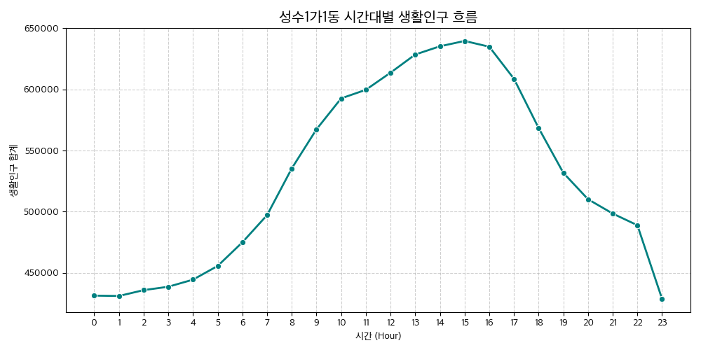
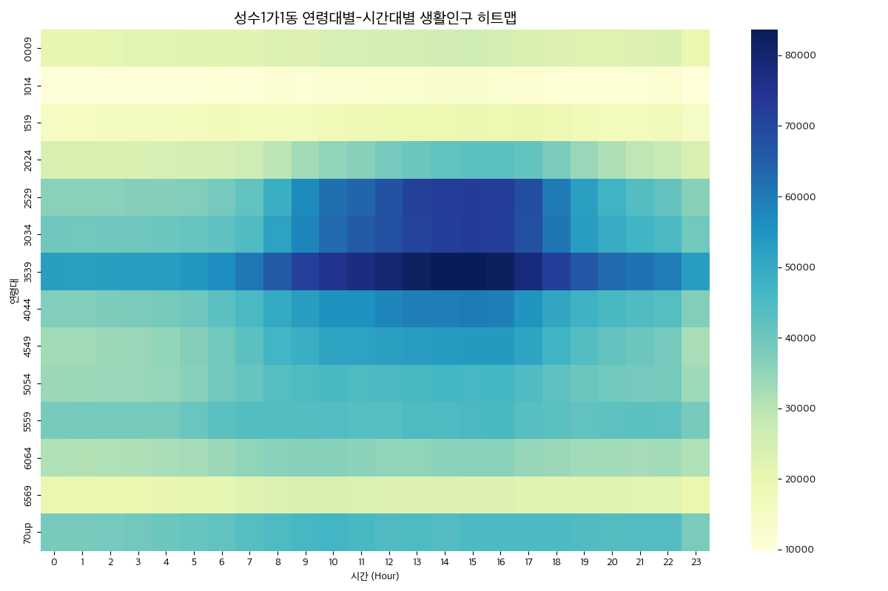

#### 기술통계 (시간대별 총 생활인구)
|           |   count |   mean |     std |    min |    25% |    50% |    75% |    max |
|:----------|--------:|-------:|--------:|-------:|-------:|-------:|-------:|-------:|
| pop_count |      24 | 528755 | 76828.7 | 428524 | 452783 | 520918 | 601893 | 639613 |

#### 시간대별 연령별 교차표 (2시간 간격 요약)
| age_group   |       0 |       2 |       4 |       6 |       8 |      10 |      12 |      14 |      16 |      18 |      20 |      22 |
|:------------|--------:|--------:|--------:|--------:|--------:|--------:|--------:|--------:|--------:|--------:|--------:|--------:|
| 0009        | 20668.9 | 21285.2 | 21783.9 | 22231.2 | 23442.7 | 24546.2 | 25659.4 | 25862.7 | 24995.9 | 23325   | 22687.1 | 23819.5 |
| 1014        | 10220.5 | 10531.4 | 10786.7 | 10999.8 | 11604.2 | 12155   | 12707.7 | 12818.5 | 12372.7 | 11558.3 | 11235.5 | 11810.5 |
| 1519        | 15167.4 | 15594.7 | 16138.3 | 16805.9 | 16255.7 | 17332.2 | 18795   | 19331   | 19323.4 | 18490.5 | 16624.1 | 16776.5 |
| 2024        | 24043.5 | 24098.8 | 24695.2 | 25613.6 | 29482.6 | 35256.7 | 39046.4 | 42003.6 | 42471.9 | 38112.1 | 31703.3 | 27693.9 |
| 2529        | 36232.8 | 36334.2 | 36845.2 | 38970.9 | 48626.9 | 61828.8 | 67613.7 | 72283.7 | 72178.7 | 60215.7 | 47239.3 | 41499   |
| 3034        | 39837.7 | 39856.5 | 40495.7 | 42385.7 | 51656.8 | 62806.2 | 68270.1 | 71963.1 | 71978.8 | 60681.3 | 49398.2 | 45323.3 |
| 3539        | 52690.6 | 52611.8 | 53077.2 | 56442.8 | 66034.6 | 75007.4 | 79463.7 | 83349.3 | 82196.8 | 71985.9 | 63069.2 | 59376   |
| 4044        | 37456.9 | 38012.5 | 38709.8 | 42447.6 | 49730.4 | 55472   | 57702.2 | 59315.7 | 58923.2 | 50855.7 | 45664.8 | 43578.9 |
| 4549        | 32915.9 | 33953.1 | 35005.7 | 39739   | 46450.4 | 51116.9 | 52352.7 | 53445.7 | 53886.1 | 47094.5 | 41395   | 39135.2 |
| 5054        | 33842.4 | 34268.5 | 34837.3 | 39297.7 | 43653.1 | 45725   | 45394.8 | 46354.8 | 46355.3 | 42251   | 39718.6 | 38907.5 |
| 5559        | 38536.2 | 38794.2 | 38902.1 | 42553.1 | 44028.7 | 44211.7 | 43819.1 | 44794.8 | 45609.1 | 42723.1 | 42296   | 42201.4 |
| 6064        | 31295.1 | 31437.4 | 32175.3 | 33991.9 | 36289.2 | 36369   | 35417.6 | 36043.4 | 36286.2 | 33827.1 | 32942.8 | 32923   |
| 6569        | 19730.5 | 19834.9 | 20340.8 | 21317.4 | 23381.5 | 24120.7 | 22957.1 | 23246.7 | 23160.9 | 22241.9 | 22298.2 | 21654.4 |
| 70up        | 38650.6 | 39170.2 | 40575.4 | 42104.8 | 44721.6 | 46691.5 | 44455.5 | 44423.8 | 45147.2 | 45005.6 | 43853.1 | 44156.8 |

---

### 📍 성수1가2동 상세 분석

#### [시간대별 흐름 및 인구 구조]
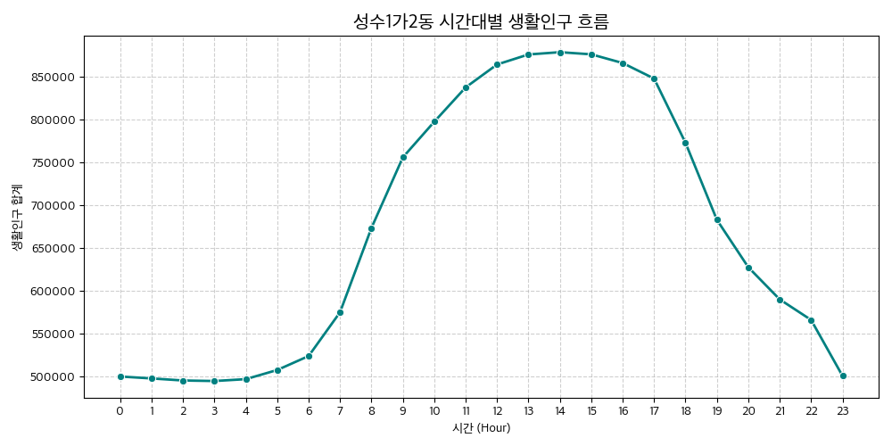
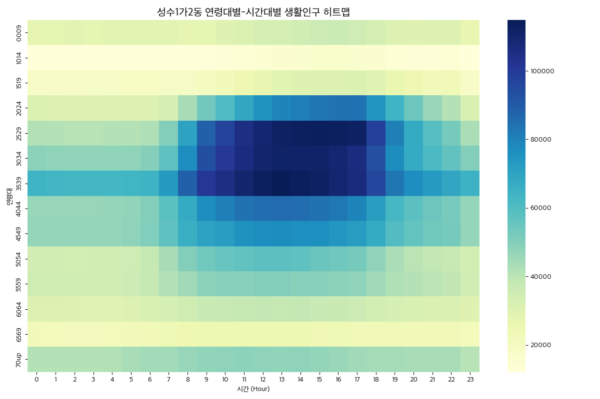

#### 기술통계 (시간대별 총 생활인구)
|           |   count |   mean |    std |    min |    25% |    50% |    75% |    max |
|:----------|--------:|-------:|-------:|-------:|-------:|-------:|-------:|-------:|
| pop_count |      24 | 671393 | 155057 | 495069 | 506223 | 650852 | 840515 | 879045 |

#### 시간대별 연령별 교차표 (2시간 간격 요약)
| age_group   |       0 |       2 |       4 |       6 |       8 |       10 |       12 |       14 |       16 |      18 |      20 |      22 |
|:------------|--------:|--------:|--------:|--------:|--------:|---------:|---------:|---------:|---------:|--------:|--------:|--------:|
| 0009        | 27757.7 | 28206.3 | 28242.2 | 28451.3 | 27688.4 |  29988.8 |  33013   |  34854.6 |  36543   | 33202.4 | 29894.8 | 30985.5 |
| 1014        | 12509.4 | 12711.7 | 12727.9 | 12822.2 | 12478.4 |  13515.2 |  14877.7 |  15707.4 |  16468.2 | 14963.3 | 13473   | 13964.4 |
| 1519        | 18437   | 18713.2 | 19301.6 | 19694.8 | 19275.1 |  22100.7 |  26667.6 |  29851.9 |  30908.1 | 29360.3 | 24184.6 | 22760.6 |
| 2024        | 31073.5 | 30154.1 | 30228.6 | 30916.4 | 43836.1 |  60663.2 |  74949.5 |  81145.8 |  84218.8 | 74689.4 | 54369.3 | 41077.6 |
| 2529        | 41738.8 | 41019.8 | 41060.5 | 42402.2 | 70513   |  96863.6 | 109737   | 113121   | 113189   | 98168.4 | 67596.4 | 52626.3 |
| 3034        | 48491.1 | 47679.2 | 47784   | 49504.9 | 76806   | 100578   | 110430   | 111088   | 109531   | 93544.5 | 67777.5 | 56946.6 |
| 3539        | 64013   | 62929.6 | 63079.8 | 64612.9 | 88683   | 105543   | 113068   | 113553   | 109671   | 96150.7 | 76988.2 | 69470.6 |
| 4044        | 46642.3 | 46270.1 | 46904.1 | 50029.2 | 67693.4 |  80570.4 |  85459.1 |  85416.3 |  82595.3 | 71532.9 | 57672.2 | 52071.7 |
| 4549        | 46712.9 | 46771.2 | 46803.2 | 50354.3 | 65913.1 |  72566.8 |  77034   |  76542.8 |  74292.9 | 67807.7 | 56532.6 | 52436.4 |
| 5054        | 34465.1 | 34090.9 | 34386.9 | 38098.1 | 50011.4 |  55758.9 |  57863.8 |  57156.9 |  54089.7 | 47869.3 | 40107.8 | 37642.8 |
| 5559        | 35131.8 | 34748.8 | 34306.5 | 38160.7 | 44900.4 |  49188.2 |  50209.6 |  49426.6 |  48460.1 | 45011.5 | 41224.8 | 38713.6 |
| 6064        | 30256.1 | 29825.1 | 29496.5 | 31815   | 35339.2 |  37736.4 |  38284.2 |  38407.8 |  36652.8 | 33814.3 | 32140.1 | 31508.1 |
| 6569        | 21900.7 | 21350.4 | 21383.4 | 22972.3 | 24303.9 |  24781.9 |  24841.1 |  24589.3 |  23593.6 | 22904.1 | 22611.4 | 22834.5 |
| 70up        | 41194   | 41223.4 | 41547.6 | 44398.5 | 46348   |  47966.1 |  48248   |  48183   |  46162.8 | 44225   | 43341.5 | 43374   |

---

### 📍 성수2가1동 상세 분석

#### [시간대별 흐름 및 인구 구조]
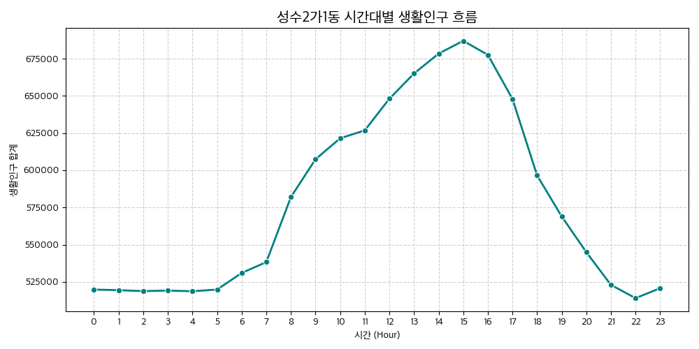
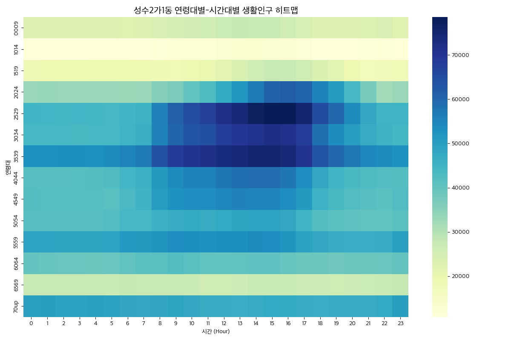

#### 기술통계 (시간대별 총 생활인구)
|           |   count |   mean |     std |    min |    25% |    50% |    75% |    max |
|:----------|--------:|-------:|--------:|-------:|-------:|-------:|-------:|-------:|
| pop_count |      24 | 578954 | 62812.9 | 514067 | 519837 | 556925 | 632098 | 686975 |

#### 시간대별 연령별 교차표 (2시간 간격 요약)
| age_group   |       0 |       2 |       4 |       6 |       8 |      10 |      12 |      14 |      16 |      18 |      20 |      22 |
|:------------|--------:|--------:|--------:|--------:|--------:|--------:|--------:|--------:|--------:|--------:|--------:|--------:|
| 0009        | 23060.1 | 23041   | 22924.8 | 22662.2 | 24091.9 | 25420.7 | 26954.5 | 27694.3 | 26307.5 | 22793.1 | 23061.7 | 24240.6 |
| 1014        | 11015.5 | 11008.8 | 10951.7 | 10824.5 | 11509.8 | 12141.9 | 12921.7 | 13370.7 | 12692.2 | 10953.8 | 11054.7 | 11588.1 |
| 1519        | 18517.3 | 19096.4 | 19326.7 | 19427.1 | 18327.7 | 18960   | 21649.6 | 26195   | 27125.4 | 24027.5 | 18982.6 | 17262.5 |
| 2024        | 33083.5 | 33220.4 | 33233.7 | 33003.9 | 35461.2 | 40027.9 | 47332.4 | 56502.8 | 61877.3 | 55382.7 | 44114.9 | 32247.8 |
| 2529        | 44708.1 | 44415.4 | 44364.5 | 44719.2 | 55561.3 | 64825.9 | 71518.4 | 76975.1 | 78548.9 | 65352.2 | 53981.7 | 44996.9 |
| 3034        | 44003.6 | 44016.2 | 43914.8 | 45052.2 | 55655.3 | 63685.3 | 67948.6 | 70700.9 | 71230.5 | 58501.8 | 50243.3 | 45341.5 |
| 3539        | 53128   | 53172.9 | 52994.2 | 55262.3 | 63821   | 70485.4 | 73480   | 75269.6 | 74165.5 | 63208.7 | 57140.3 | 53729.8 |
| 4044        | 41750.5 | 41752.8 | 42059   | 44618.1 | 51298.1 | 55337.3 | 57489.5 | 59002.8 | 57642.8 | 48107.9 | 43825.2 | 42415.9 |
| 4549        | 42242   | 41951.2 | 41880.9 | 43530.8 | 50497.9 | 53570   | 54714.8 | 54882.3 | 53585   | 45723.2 | 42350.5 | 41121.6 |
| 5054        | 41740.4 | 41742.7 | 41750.2 | 43997.4 | 45958.2 | 47390.1 | 47713.4 | 49284.1 | 47885.4 | 42184.6 | 40607.2 | 39997.9 |
| 5559        | 49379.6 | 48831.8 | 48966.4 | 51318.8 | 52318.2 | 53290.5 | 53196.8 | 53692.7 | 52267.3 | 47950.2 | 46749.5 | 46904.3 |
| 6064        | 39662.9 | 39319.6 | 38996.5 | 40204.6 | 41396.2 | 41266.6 | 40043.1 | 40569.8 | 39544.8 | 38861.6 | 38872.8 | 39365.2 |
| 6569        | 27636.1 | 27522.2 | 27381.5 | 27785.9 | 27683.3 | 27064.5 | 26232.1 | 26975.4 | 27185.7 | 26666.6 | 26627.5 | 27130.3 |
| 70up        | 49909.9 | 49705.9 | 49961.6 | 48590.8 | 48472.9 | 48005   | 46882.5 | 47282.8 | 47477.4 | 46787.7 | 47312.6 | 47724.8 |

---

### 📍 성수2가3동 상세 분석

#### [시간대별 흐름 및 인구 구조]
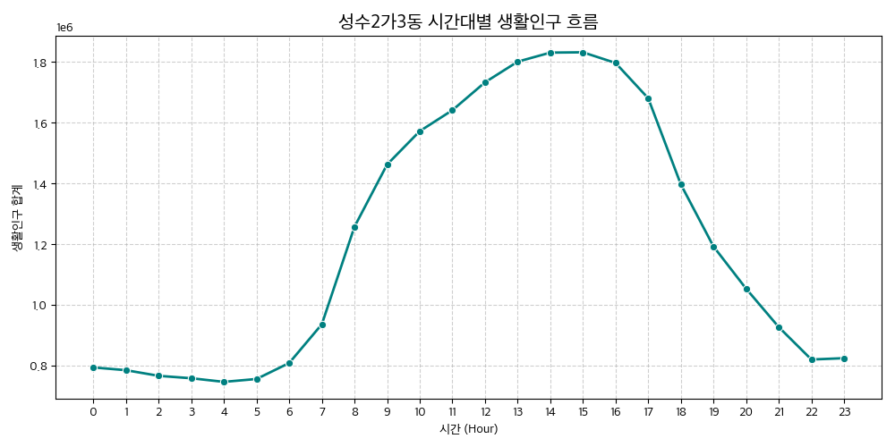
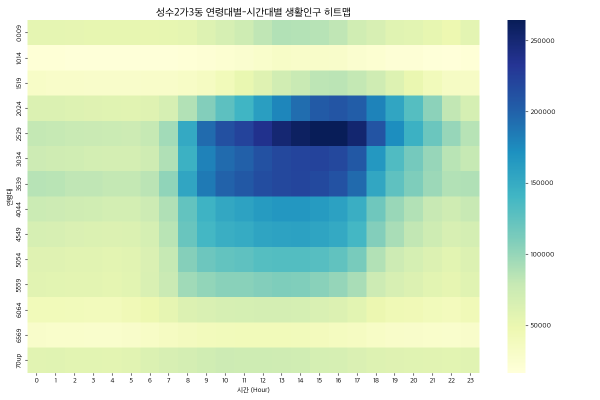

#### 기술통계 (시간대별 총 생활인구)
|           |   count |        mean |    std |    min |    25% |         50% |         75% |         max |
|:----------|--------:|------------:|-------:|-------:|-------:|------------:|------------:|------------:|
| pop_count |      24 | 1.21538e+06 | 427058 | 746374 | 804865 | 1.12274e+06 | 1.65089e+06 | 1.83173e+06 |

#### 시간대별 연령별 교차표 (2시간 간격 요약)
| age_group   |       0 |       2 |       4 |       6 |        8 |       10 |       12 |       14 |       16 |       18 |       20 |      22 |
|:------------|--------:|--------:|--------:|--------:|---------:|---------:|---------:|---------:|---------:|---------:|---------:|--------:|
| 0009        | 54727.9 | 53769.2 | 52733.8 | 51974.8 |  54701.5 |  66169.6 |  81582.8 |  87076   |  82387.8 |  65304.7 |  56941.1 | 48462.7 |
| 1014        | 18821.5 | 18485.3 | 18123   | 17859   |  18761.9 |  22687   |  28100.4 |  30072.4 |  28468.6 |  22512.6 |  19573.9 | 16617.8 |
| 1519        | 30624.6 | 29209   | 28375.1 | 29425.6 |  31174.7 |  41372.6 |  59769.9 |  76710   |  83507.2 |  71931.7 |  50277.7 | 33399.8 |
| 2024        | 62598.8 | 61006.9 | 58817.8 | 59846.9 |  87517.3 | 126938   | 160157   | 193240   | 209085   | 179482   | 130359   | 81209.3 |
| 2529        | 80396.5 | 77045.8 | 74769.7 | 78672.3 | 151936   | 212219   | 237216   | 259183   | 264159   | 209738   | 144594   | 99173.4 |
| 3034        | 74241.4 | 70868   | 68650.7 | 72539   | 145251   | 194418   | 211298   | 221226   | 218685   | 164791   | 114594   | 84815.8 |
| 3539        | 85547.3 | 82402.1 | 80504.3 | 84319.6 | 154639   | 199746   | 214731   | 219906   | 210535   | 153537   | 109581   | 87576   |
| 4044        | 75542.9 | 72130.6 | 69559   | 74680.6 | 123440   | 152593   | 163288   | 165949   | 158636   | 118226   |  87666.7 | 71863.2 |
| 4549        | 66168   | 63177.5 | 61157   | 67712.6 | 120674   | 146398   | 155583   | 158389   | 152068   | 108411   |  81279.2 | 65788.6 |
| 5054        | 60037.5 | 57593   | 56202.2 | 63985.6 | 107346   | 123271   | 129979   | 131387   | 124645   |  87375.6 |  67414.7 | 56329   |
| 5559        | 57643.4 | 56167.9 | 55084.5 | 64139.6 |  95059.7 | 104738   | 108406   | 108871   | 100011   |  73878.4 |  61198.1 | 53470.6 |
| 6064        | 41055   | 40231.8 | 39695.8 | 48484.9 |  61253.8 |  66615   |  68391.6 |  67204.8 |  61481   |  48684.8 |  42893.7 | 38173.8 |
| 6569        | 28469.1 | 27353.3 | 27021.9 | 31817.7 |  37476.8 |  40641.7 |  41374.3 |  40360.4 |  36790.6 |  31567.6 |  28397.2 | 26531.6 |
| 70up        | 58061.6 | 56800.4 | 55679   | 63050.2 |  68090.8 |  74235.8 |  73016.7 |  71108.3 |  66138.6 |  61102.6 |  58422.3 | 56570.6 |

---

### 📍 역삼1동 상세 분석

#### [시간대별 흐름 및 인구 구조]
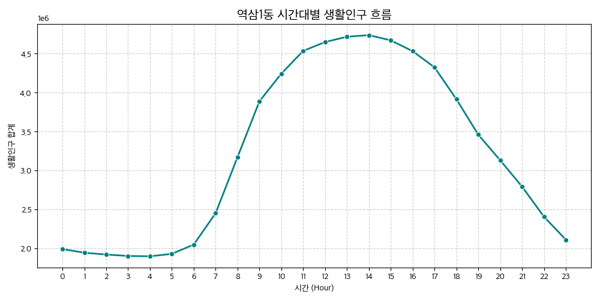
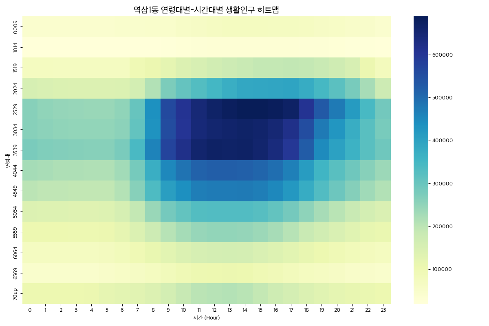

#### 기술통계 (시간대별 총 생활인구)
|           |   count |        mean |         std |         min |         25% |         50% |         75% |         max |
|:----------|--------:|------------:|------------:|------------:|------------:|------------:|------------:|------------:|
| pop_count |      24 | 3.22301e+06 | 1.13119e+06 | 1.89713e+06 | 2.03345e+06 | 3.15072e+06 | 4.37563e+06 | 4.73756e+06 |

#### 시간대별 연령별 교차표 (2시간 간격 요약)
| age_group   |        0 |        2 |        4 |        6 |        8 |       10 |       12 |       14 |       16 |       18 |       20 |       22 |
|:------------|---------:|---------:|---------:|---------:|---------:|---------:|---------:|---------:|---------:|---------:|---------:|---------:|
| 0009        |  44675.3 |  44414.1 |  44753.2 |  45722.5 |  48499.3 |  57063.6 |  68448.7 |  73600.3 |  71162.5 |  67109.4 |  58751.2 |  51427.8 |
| 1014        |  19699.4 |  19587.4 |  19737.1 |  20165.4 |  21396.1 |  25190.5 |  30225.9 |  32508.5 |  31441.7 |  29635   |  25935.2 |  22683.2 |
| 1519        |  74003.5 |  71364.8 |  70349   |  71246.2 | 106006   | 139838   | 164435   | 183644   | 190907   | 190019   | 170805   | 105978   |
| 2024        | 154995   | 144654   | 139988   | 144224   | 212793   | 305842   | 351489   | 386050   | 392669   | 376518   | 320037   | 224707   |
| 2529        | 261516   | 246644   | 241406   | 249775   | 435768   | 607182   | 667143   | 689157   | 682986   | 608003   | 476134   | 344190   |
| 3034        | 262022   | 251970   | 247126   | 256152   | 434433   | 603636   | 657523   | 666042   | 648270   | 555095   | 426258   | 322166   |
| 3539        | 276036   | 265699   | 261854   | 276719   | 461105   | 620353   | 669232   | 668486   | 637404   | 525591   | 403621   | 320644   |
| 4044        | 226444   | 218277   | 214711   | 229954   | 370656   | 485570   | 519342   | 517643   | 494195   | 412170   | 321184   | 261727   |
| 4549        | 201318   | 194869   | 192236   | 210313   | 338179   | 440243   | 473416   | 475046   | 452125   | 376762   | 295377   | 233075   |
| 5054        | 141263   | 137417   | 135875   | 154685   | 239888   | 308479   | 331132   | 331096   | 307763   | 254328   | 203900   | 160887   |
| 5559        | 105709   | 103793   | 102915   | 120980   | 174828   | 226451   | 247100   | 247017   | 223536   | 184242   | 149731   | 118416   |
| 6064        |  70488.3 |  69702.5 |  70589.5 |  84105.3 | 112173   | 144165   | 158965   | 158214   | 138000   | 115446   |  95029   |  77594.1 |
| 6569        |  47446   |  46499   |  48093.1 |  59171.6 |  72887.3 |  93749.1 | 103455   | 103975   |  88475.7 |  74290.2 |  61515.8 |  52131.6 |
| 70up        | 104355   | 104346   | 107494   | 124727   | 142382   | 184833   | 206856   | 205083   | 172517   | 144839   | 122170   | 109737   |

---

### 📍 역삼2동 상세 분석

#### [시간대별 흐름 및 인구 구조]
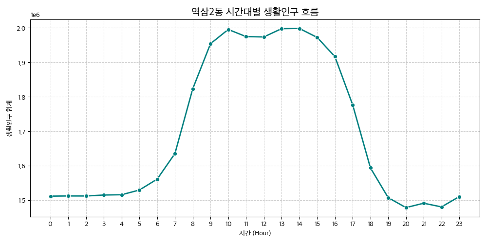
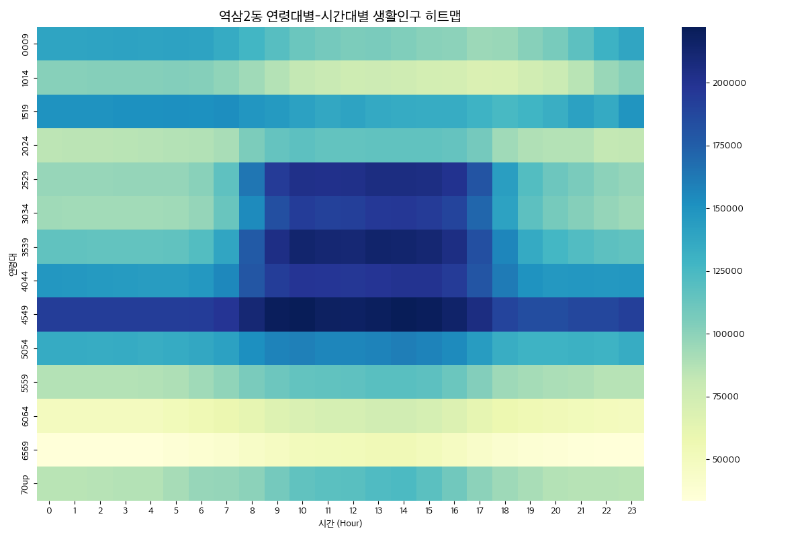

#### 기술통계 (시간대별 총 생활인구)
|           |   count |        mean |    std |         min |        25% |        50% |         75% |         max |
|:----------|--------:|------------:|-------:|------------:|-----------:|-----------:|------------:|------------:|
| pop_count |      24 | 1.69743e+06 | 216039 | 1.47854e+06 | 1.5121e+06 | 1.5775e+06 | 1.95858e+06 | 1.99835e+06 |

#### 시간대별 연령별 교차표 (2시간 간격 요약)
| age_group   |        0 |        2 |        4 |        6 |        8 |       10 |       12 |       14 |       16 |       18 |       20 |       22 |
|:------------|---------:|---------:|---------:|---------:|---------:|---------:|---------:|---------:|---------:|---------:|---------:|---------:|
| 0009        | 139087   | 139759   | 140163   | 139834   | 127811   | 112414   | 105444   | 103810   | 100243   |  95662.4 | 107048   | 130638   |
| 1014        | 101819   | 102323   | 102597   | 102318   |  93462.7 |  82170.7 |  76991.8 |  75824.4 |  73096.7 |  69749.6 |  78232.8 |  95640.9 |
| 1519        | 150078   | 150479   | 151370   | 150819   | 148358   | 141403   | 140158   | 134613   | 133863   | 125038   | 132386   | 135708   |
| 2024        |  83877.8 |  85040.3 |  86212.2 |  87576.5 | 105259   | 117335   | 115318   | 115470   | 114199   |  93673   |  87266.6 |  81899.9 |
| 2529        |  96547.1 |  96902   |  97316.4 | 101302   | 163325   | 202812   | 202800   | 205441   | 200398   | 143070   | 111638   | 100643   |
| 3034        |  93372   |  92678.4 |  93111.3 |  97003.8 | 153709   | 193571   | 192386   | 196843   | 189169   | 140507   | 107766   |  97094.5 |
| 3539        | 115600   | 115132   | 114930   | 120978   | 176818   | 213814   | 210839   | 213896   | 204870   | 156420   | 126508   | 117487   |
| 4044        | 147277   | 145747   | 144763   | 146388   | 178949   | 197952   | 196472   | 199692   | 194354   | 161338   | 147011   | 146909   |
| 4549        | 192738   | 193047   | 192880   | 193742   | 211010   | 222157   | 217391   | 221720   | 215436   | 189206   | 184121   | 187706   |
| 5054        | 135049   | 134330   | 133715   | 137450   | 151883   | 159209   | 156549   | 159807   | 153760   | 133400   | 129693   | 130087   |
| 5559        |  87147.5 |  87334.1 |  87658.6 |  93345.5 | 105976   | 115256   | 116330   | 119070   | 111973   |  94485.7 |  90119.9 |  86589.6 |
| 6064        |  49472.8 |  49244.6 |  49565.8 |  55170.4 |  61891.1 |  70478.2 |  72233.1 |  74593.5 |  67925.1 |  57376.5 |  53174.6 |  50082.7 |
| 6569        |  33813.2 |  33687.5 |  34383.4 |  38670.3 |  43993.5 |  50943.5 |  52128.9 |  53706.8 |  47579.5 |  39853.1 |  36219.5 |  33667.2 |
| 70up        |  85877.9 |  86514.1 |  87241.1 |  96563.2 | 100575   | 115883   | 118581   | 123861   | 109937   |  94064.4 |  87358   |  86403.3 |

---

**보고서 생성 일자**: 2026-02-28
**데이터 소스**: 서울시 생활인구 (2026년 01월)
