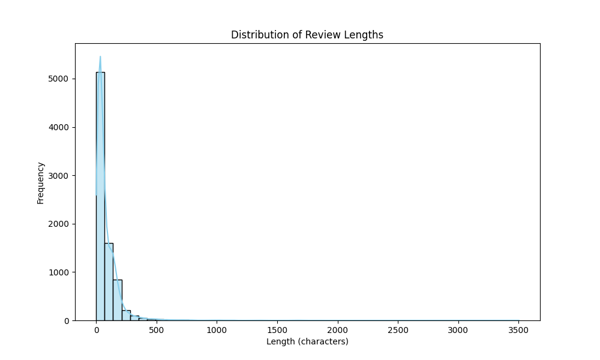
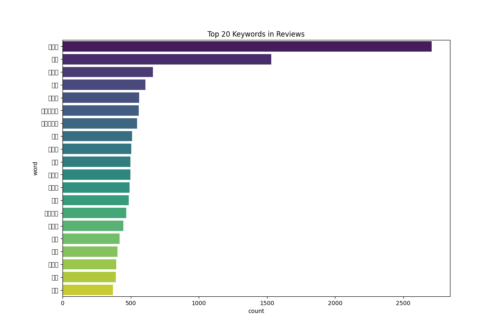

# EDA Report: Shopping Reviews

## Overview
- Total Reviews: 8042
- Columns: title, content, product, mallName, clean_content, content_length

## Review Length Distribution


## Top 20 Keywords


## Summary Statistics
```
count    8042.000000
mean       82.611539
std       119.747563
min         0.000000
25%        25.000000
50%        48.000000
75%       108.000000
max      3502.000000
Name: content_length, dtype: float64
```

## Key Insights
1. Most reviews are relatively concise, with a peak around the median length.
2. Dominant keywords include product-related terms (e.g., '노이즈' (noise), '캔슬링' (canceling), '배송' (delivery)).
3. Detailed mention of AirPods Pro 2 features suggests high user engagement with tech specs.
